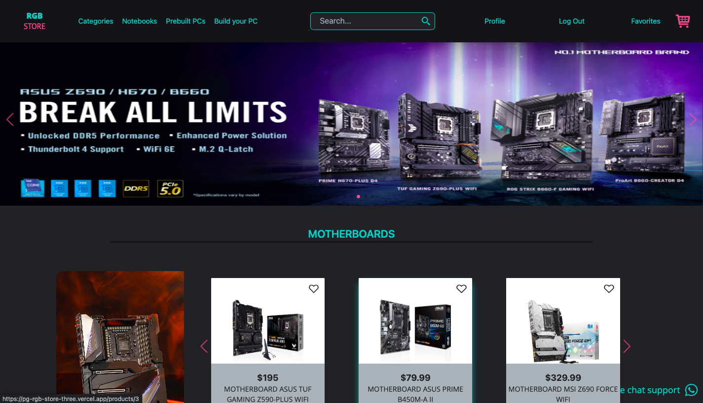
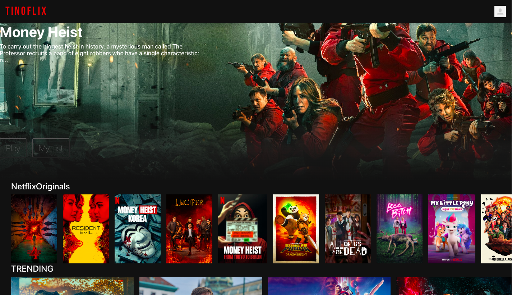

<h1 align="center">Hi! 👋, Welcome i'm Valentino Russo Barbagelata</h1>

<h2 align="center">Full Stack Developer 😁</h2>
<h4> I graduated from high school with an economic orientation, Then I apply and study the career of informatic engineering in the UNL university (UNIVERSIDAD NACIONAL DEL LITORAL) where I learned the basics of programming and acquired knowledge of Object Oriented Programming with C++. I am currently not studying Informatics ING. Thanks to this career I was able to find what I am so passionate about.</h4>
<h4>Currently I graduated as a Full Stack Developer from the Soy Henry Bootcamp  🧑‍🎓, in which I spent more than 800 hours in code.</h4>
<h4> I consider myself a self-taught person, I'm always looking to learn much more about this programming world that is so big. My career in Information Engineering led me to strengthen my logic programming. Which is why I consider that one of my strongest skills is thinking analytical, as well as contributing my knowledge so that the user experience is more friendly.</h4>

- I am interested in everything related to web development.

- 💬 Ask me about: **React JS, JavaScript, Node JS, expressJS , POSTRESQL ,HTML5, CSS3,POSTMAN,NPM,GIT,GITFLOW**

🧑‍🎓 Technologies I know/ use:

- 🧠 Front End: JavaScript, React, Redux, HTML5, CSS3
- 🧠 BackEnd: NodeJS, expressJS
- 🧠 Database: mySql, SQL server, PostgreSQL
- 🧠 Other technologies: C++

🎖️ I am currently learning: MongoDB, Typescript,
😁 I'm interested in learning: Back-end Technologies

<h1 align="center">My skills</h1>

 
 
 
 

 
  
   
    

 <h1 align="center">My proyects</h1>
 

<a href="https://pi-food-tino-russo.vercel.app/">
 
 Individual Proyect of SoyHenry
 </a>
 <a href="https://pg-rgb-store-three.vercel.app/">
 
    Final Group Proyect of SoyHenry
 </a>
  <a href="https://netflix-clone-tinorusso1012.vercel.app">
 
      Individual Proyect to Practice
 </a>

<h1 align="center">Contact me:</h1>

